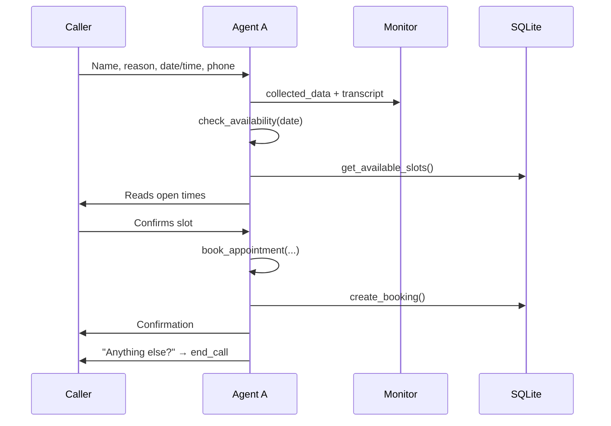

# SwadesAI — Project Documentation

SwadesAI is a **conversational voice agent** for a fictional clinic, **Swades Health**. It was built for a LiveKit hackathon and delivers a full phone-style experience: appointment booking, live call monitoring, watcher takeover, warm transfer to a human supervisor, and post-call summaries.

---

## Table of contents

1. [Overview](#overview)
2. [Architecture](#architecture)
3. [Tech stack](#tech-stack)
4. [Repository layout](#repository-layout)
5. [Environment configuration](#environment-configuration)
6. [Running the project](#running-the-project)
7. [User-facing flows](#user-facing-flows)
8. [Backend modules](#backend-modules)
9. [Agent tools](#agent-tools)
10. [Resilience layer](#resilience-layer)
11. [Live monitoring protocol](#live-monitoring-protocol)
12. [Frontend application](#frontend-application)
13. [Database schema](#database-schema)
14. [Troubleshooting](#troubleshooting)
15. [Demo videos](#demo-videos)
16. [Demo checklist](#demo-checklist)

---

## Overview

**Agent A** is a voice receptionist that:

- Greets callers and collects booking details (name, reason, date/time, phone)
- Checks clinic availability and confirms appointments
- Publishes live events to a monitoring dashboard
- Allows a human watcher to take over the call from the browser
- Performs a **warm transfer** to a supervisor phone via Twilio SIP
- Generates a post-call summary when the session ends

The clinic schedule is simplified for the demo:

| Rule | Value |
|------|--------|
| Open days | Monday – Friday |
| Hours | 9:00 AM – 5:00 PM |
| Slot length | 30 minutes |
| Storage | SQLite (`backend/data/appointments.db`) |

Languages supported:

| `AGENT_LANGUAGE` | STT / TTS provider |
|------------------|-------------------|
| `en` (default) | Deepgram |
| `ml` / `malayalam` | Sarvam AI |

---

## Architecture

```
┌─────────────────────────────────────────────────────────────────────────┐
│                           LiveKit Cloud Room                            │
│  ┌──────────────┐    ┌─────────────────────┐    ┌──────────────────┐  │
│  │ Caller       │◄──►│ Python Agent A       │    │ Watcher (browser)│  │
│  │ (web / SIP)  │    │ STT → Groq → TTS     │    │ /monitor         │  │
│  └──────────────┘    │ + function tools     │    └────────▲─────────┘  │
│                      └──────────┬──────────┘             │            │
│                                 │ data topic "monitor"     │            │
└─────────────────────────────────┼──────────────────────────┼────────────┘
                                  │                          │
                     WarmTransferTask (SIP outbound)         │
                                  ▼                          │
                       ┌──────────────────┐                  │
                       │ Supervisor phone │                  │
                       │ (Twilio PSTN)    │                  │
                       └──────────────────┘                  │
                                                              │
┌─────────────────────────────────────────────────────────────┼──────────┐
│ Next.js frontend                                            │          │
│  /call ─ token + dispatch agent                             │          │
│  /monitor ─ join room as watcher ───────────────────────────┘          │
│  /appointments ─ read SQLite via API                                     │
│  /api/token, /api/mute-agent, /api/summary, /api/appointments          │
└────────────────────────────────────────────────────────────────────────┘
```

**Voice pipeline (Agent A):**

```
Caller audio → STT (Deepgram / Sarvam)
            → Groq LLM (llama-3.1-8b-instant) + tools
            → TTS (Deepgram / Sarvam)
            → Caller audio
```

Parallel path: `MonitorPublisher` listens to conversation events and pushes structured JSON over LiveKit data channels so the dashboard updates in real time.

---

## Tech stack

| Layer | Technology |
|-------|------------|
| Voice runtime | [LiveKit Agents SDK](https://docs.livekit.io/agents/) |
| LLM | [Groq](https://console.groq.com) (`llama-3.1-8b-instant`) |
| English voice | [Deepgram](https://deepgram.com) STT + TTS |
| Malayalam voice | [Sarvam AI](https://www.sarvam.ai) STT + TTS |
| Telephony | LiveKit SIP + [Twilio](https://twilio.com) |
| Backend | Python 3.10+ |
| Frontend | Next.js 15, React 19, Tailwind CSS 4 |
| Database | SQLite |

---

## Repository layout

```
swadesAI/
├── .env.example                 # Backend env template
├── README.md                    # Quick start (links here)
├── hackathon-requirement.txt    # Original brief
├── docs/
│   └── PROJECT.md               # This document
│
├── backend/
│   ├── agent.py                 # LiveKit worker entrypoint + ReceptionistAgent
│   ├── monitor.py               # Live monitor event publisher + fallbacks
│   ├── booking.py                 # SQLite appointments + availability
│   ├── intake_tracker.py        # Spoken-field parsing when tools misfire
│   ├── speech_filters.py        # Strip leaked tool JSON from speech
│   ├── voice_config.py          # Language, STT/TTS, system prompts
│   ├── summary.py               # Post-call + transfer brief generation
│   ├── requirements.txt
│   ├── data/                    # appointments.db (created at runtime)
│   └── scripts/
│       ├── get_call_summary.py  # CLI for /api/summary
│       └── list_appointments.py # CLI for /api/appointments
│
└── frontend/
    ├── .env.local.example
    └── src/
        ├── app/
        │   ├── call/            # Web caller UI
        │   ├── monitor/         # Watcher dashboard
        │   ├── appointments/    # Bookings table
        │   └── api/             # Token, mute, summary, appointments
        ├── components/
        │   ├── VoiceRoom.tsx    # Shared LiveKit client
        │   ├── MonitorPanels.tsx
        │   └── AppointmentsList.tsx
        └── lib/
            ├── livekit.ts
            └── summary.ts
```

---

## Environment configuration

Copy templates and fill in credentials:

```bash
cp .env.example .env
cp frontend/.env.local.example frontend/.env.local
```

### Backend (`.env` at repo root or `backend/.env`)

| Variable | Required | Description |
|----------|----------|-------------|
| `LIVEKIT_URL` | Yes | WebSocket URL from LiveKit Cloud |
| `LIVEKIT_API_KEY` | Yes | Server API key |
| `LIVEKIT_API_SECRET` | Yes | Server API secret |
| `GROQ_API_KEY` | Yes | LLM conversation + summaries |
| `GROQ_MODEL` | No | Default `llama-3.1-8b-instant` |
| `GROQ_SUMMARY_MODEL` | No | Summary / transfer brief model |
| `AGENT_NAME` | No | Default `swades-agent`; must match dispatch rule |
| `AGENT_LANGUAGE` | No | `en` or `ml` |
| `DEEPGRAM_API_KEY` | If `en` | English STT/TTS |
| `SARVAM_API_KEY` | If `ml` | Malayalam STT/TTS |
| `LIVEKIT_SIP_OUTBOUND_TRUNK` | For transfer | Outbound trunk ID (not inbound) |
| `LIVEKIT_SUPERVISOR_PHONE_NUMBER` | For transfer | Supervisor E.164 number |
| `LIVEKIT_SIP_NUMBER` | For transfer | Caller ID shown to supervisor |
| `INBOUND_PHONE_NUMBER` | For PSTN | Twilio inbound number (display/docs) |

Optional tuning: `DEEPGRAM_*`, `SARVAM_*` model and speaker variables (see `.env.example`).

### Frontend (`frontend/.env.local`)

| Variable | Description |
|----------|-------------|
| `LIVEKIT_URL` | Used by API routes |
| `LIVEKIT_API_KEY` / `LIVEKIT_API_SECRET` | Token minting, agent dispatch, mute |
| `AGENT_NAME` | Must match backend |
| `NEXT_PUBLIC_LIVEKIT_URL` | Optional client display |
| `NEXT_PUBLIC_INBOUND_PHONE_NUMBER` | Shown on home page |

The backend reloads env on worker start from root `.env`, `backend/.env`, or `.env.local` variants.

---

## Running the project

### Prerequisites

- LiveKit Cloud project
- Groq API key
- Deepgram (English) or Sarvam (Malayalam) API key
- Twilio + LiveKit SIP trunks for phone calls and warm transfer
- Python 3.10+, Node.js 18+

### Backend

```bash
cd backend
python -m venv .venv
source .venv/bin/activate          # Windows: .venv\Scripts\activate
pip install -r requirements.txt
python agent.py dev                # LiveKit worker — required for real calls
```

Local mic test without a LiveKit room:

```bash
python agent.py console
```

### Frontend

```bash
cd frontend
npm install
npm run dev
```

Open [http://localhost:3000](http://localhost:3000):

| Route | Purpose |
|-------|---------|
| `/call` | Start a web call (dispatches Agent A) |
| `/monitor` | Join as watcher with room name |
| `/appointments` | View booked appointments |

**Both backend and frontend must run** for web calls. If the worker is down, token dispatch fails.

### SIP / Twilio setup

1. Create an **inbound** SIP trunk in LiveKit → Twilio
2. Add a **dispatch rule** targeting agent name `swades-agent`
3. Create an **outbound** SIP trunk for warm transfer
4. Assign your Twilio number to the inbound trunk
5. On **Twilio trial accounts**, verify the supervisor number in [Verified Caller IDs](https://console.twilio.com/us1/develop/phone-numbers/manage/verified)

Reference: [LiveKit warm-transfer example](https://github.com/livekit/agents/tree/main/examples/warm-transfer)

---

## User-facing flows

### 1. Appointment booking



**Intake order:** name → reason → preferred date/time → phone → confirm → book.

After booking, Agent A asks if the caller is all set to end the call. On confirmation, it says goodbye and shuts down the session.

### 2. Live monitoring

1. Watcher opens `/monitor` and enters the **room name** (shown on `/call` or in LiveKit dashboard for SIP calls).
2. Clicks **Join as Watcher** — receives a JWT without agent dispatch.
3. Dashboard shows:
   - Live transcript
   - Agent state (listening / thinking / speaking)
   - Intent and action (e.g. `booking` / `checking_availability`)
   - Collected booking fields
   - Call status badge
   - Post-call summary (live event or polled)

### 3. Watcher takeover

1. Watcher clicks **Take Over**.
2. Frontend sends `{ type: "takeover", action: "start" }` on data topic `monitor`.
3. Agent mutes its own input/output and interrupts current speech.
4. Frontend enables watcher microphone and calls `/api/mute-agent` to mute agent audio tracks server-side.
5. **Release to Agent** sends `action: "end"` and restores Agent A.

### 4. Warm transfer

1. Caller asks for a human (billing, complaint, “talk to a person”).
2. Agent confirms, then invokes `transfer_to_human(reason)`.
3. Caller hears a hold message; hold music plays via `WarmTransferTask`.
4. Agent generates a **transfer brief** (Groq + transcript + collected data) and publishes it to the monitor.
5. Supervisor is dialed via outbound SIP.
6. A sub-agent briefs the supervisor with the call summary and asks: *“Would you like me to connect the caller to you now?”*
7. **Accept** → `connect_to_caller` merges lines; Agent A exits.
8. **Decline / no answer** → caller hears an apology; Agent A resumes.

> **Important:** `WarmTransferTask` must run inside the `transfer_to_human` tool function. It cannot be started from a background task.

### 5. Post-call summary

On session shutdown:

1. Final auto-book attempt if fields are complete but the tool was missed
2. Groq generates 3–5 bullet points from the transcript
3. Summary saved to `call_logs` in SQLite
4. `{ type: "summary", text }` published on the data channel
5. Frontend polls `/api/summary?room=...` (via Python script) as a fallback

---

## Backend modules

### `agent.py`

- Defines `ReceptionistAgent` with LLM tools
- Configures STT → Groq → TTS pipeline
- Filters leaked tool syntax in `llm_node` / `tts_node`
- Registers takeover handler on LiveKit data channel
- Runs `WarmTransferTask` for human handoff
- Shutdown hook: auto-book + summary generation

### `monitor.py`

- `MonitorPublisher` publishes JSON events on topic `"monitor"`
- Tracks collected booking fields, intent, action, call status
- **Fallback logic** when the LLM skips tools or leaks JSON (see below)
- Handles call-end confirmation after booking
- Queues transfer via callback when transfer cues are detected

### `booking.py`

- SQLite schema and slot logic
- `get_available_slots`, `create_booking`, `list_appointments`
- `find_booking_by_phone_and_slot` prevents duplicate-booking confusion
- Human-readable slot formatting

### `intake_tracker.py`

- Parses spoken names, dates, times, phone numbers from user replies
- Detects confirmation phrases and transfer/end-call intent
- Used when `pending_field` is set from agent questions

### `speech_filters.py`

- Removes tool names and JSON from TTS output
- Parses leaked tool calls so side effects still run

### `voice_config.py`

- Language normalization (`en` / `ml`)
- Builds system instructions and greeting text
- Returns configured STT/TTS instances

### `summary.py`

- `generate_and_save_summary` — post-call bullets via Groq
- `generate_transfer_brief` — supervisor-facing brief before warm transfer

---

## Agent tools

| Tool | Purpose |
|------|---------|
| `check_availability(preferred_date)` | List open slots for a date |
| `book_appointment(name, reason, slot_datetime, phone)` | Persist booking |
| `end_call()` | Goodbye + shutdown after booking confirmed |
| `transfer_to_human(reason)` | Warm transfer to supervisor |

Tools are invoked silently; the agent speaks natural language only.

---

## Resilience layer

Groq 8b sometimes **speaks tool JSON** instead of invoking tools correctly. SwadesAI compensates with three mechanisms:

### 1. Speech filters (`speech_filters.py`)

Strips patterns like `{"reason":"human agent"}` and `transfer_to_human>{...}` before TTS.

### 2. Leaked tool recovery (`agent.py` + `monitor.py`)

Parsed leaks trigger the same side effects as proper tool calls (availability check, booking, transfer queue).

### 3. Conversation heuristics (`monitor.py` + `intake_tracker.py`)

| Trigger | Action |
|---------|--------|
| Agent says “let me check…” / “I'll check our schedule” | Auto availability check |
| User gives phone with all fields present | Auto-book |
| Agent confirms booking + user says “yes” | Finalize booking |
| Agent offers to end call + user confirms | `end_call` |
| Agent commits to transfer / leaks transfer JSON | Queue `transfer_to_human` |
| Booking already saved but tool called again | Return confirmation, don’t double-book |

---

## Live monitoring protocol

All events use LiveKit data topic **`monitor`**.

| Event type | Payload | Description |
|------------|---------|-------------|
| `transcript` | `{ role, text }` | Sanitized utterance |
| `state` | `{ status, intent, action, takeover }` | Agent activity |
| `call_status` | `{ status }` | `connected`, `transferring`, `takeover`, `ended` |
| `collected_data` | `{ data: { name, reason, ... } }` | Booking intake |
| `transfer_brief` | `{ text }` | Supervisor summary before transfer |
| `summary` | `{ text }` | Post-call summary |
| `takeover` | `{ action: "start" \| "end" }` | Watcher → agent control |

---

## Frontend application

### `VoiceRoom.tsx`

Shared LiveKit room client for caller and watcher modes:

- Fetches JWT from `/api/token`
- Subscribes to monitor data events
- Takeover controls and summary polling

### API routes

| Route | Method | Role |
|-------|--------|------|
| `/api/token` | POST | Mint JWT; dispatch agent for callers |
| `/api/mute-agent` | POST | Mute agent tracks during takeover |
| `/api/summary` | GET | Read summary from SQLite via Python script |
| `/api/appointments` | GET | List appointments via Python script |

The summary and appointments routes shell out to `backend/scripts/*.py`, which require Python and the backend venv (or system `python3`) on the server.

---

## Database schema

**File:** `backend/data/appointments.db` (created on first run, gitignored)

### `appointments`

| Column | Type | Notes |
|--------|------|-------|
| id | INTEGER PK | Auto-increment |
| name | TEXT | Caller name |
| reason | TEXT | Visit reason |
| slot | TEXT UNIQUE | ISO datetime `YYYY-MM-DD HH:MM` |
| phone | TEXT | Contact number |
| created_at | TEXT | Timestamp |

### `call_logs`

| Column | Type | Notes |
|--------|------|-------|
| id | INTEGER PK | Auto-increment |
| room_name | TEXT | LiveKit room |
| summary | TEXT | Groq-generated bullets |
| created_at | TEXT | Timestamp |

---

## Troubleshooting

| Symptom | Likely cause | Fix |
|---------|--------------|-----|
| “Waiting for agent” forever | Backend worker not running | `python agent.py dev` |
| Dispatch / token error | `AGENT_NAME` mismatch | Match `.env` and LiveKit dispatch rule |
| Booking stuck after “let me check” | Date not parsed from speech | Speak clearly: “July 20 at 10:30 AM” |
| “Slot no longer available” after book | Auto-book + tool double attempt | Fixed in monitor; restart agent |
| Transfer JSON spoken aloud | LLM leak | Fixed in speech_filters; restart agent |
| `WarmTransferTask should only be awaited inside tool_functions` | Transfer started in background task | Fixed — transfer runs in `transfer_to_human` only |
| Transfer fails silently | SIP env vars missing | Set outbound trunk + supervisor phone |
| Twilio error 32100 | Trial account | Verify supervisor number in Twilio |
| Appointments page empty | No calls yet | DB created on first agent run |
| Summary not loading | Python path / venv | Ensure `backend/.venv` exists |

---

## Demo videos

Recorded walkthroughs of the main flows:

| Demo | Description | Link |
|------|-------------|------|
| **Normal call booking** | End-to-end appointment booking with Agent A | [loom.com/share/d5630100730545c58ce3cc7fbd4b3d72](https://www.loom.com/share/d5630100730545c58ce3cc7fbd4b3d72) |
| **Join as watcher** | Live monitor dashboard — transcript, state, collected data | [loom.com/share/e40af8d4bf4344ec8f554cebb91c1c88](https://www.loom.com/share/e40af8d4bf4344ec8f554cebb91c1c88) |
| **Warm transfer** | Supervisor accepts and declines connecting the caller | [loom.com/share/7ce3c87d39774840abf1317abff3624c](https://www.loom.com/share/7ce3c87d39774840abf1317abff3624c) |

---

## Demo checklist

Use this when recording additional demos:

- [x] Book an appointment (web or phone) — [demo video](https://www.loom.com/share/d5630100730545c58ce3cc7fbd4b3d72)
- [x] Monitor UI updates live (transcript, state, collected data) — [demo video](https://www.loom.com/share/e40af8d4bf4344ec8f554cebb91c1c88)
- [ ] Watcher takeover mid-call
- [x] Warm transfer — supervisor **accepts** and **declines** — [demo video](https://www.loom.com/share/7ce3c87d39774840abf1317abff3624c)
- [ ] Post-call summary visible after hangup
- [ ] Appointments visible on `/appointments`

---

## Hackathon alignment

This project implements all items from `hackathon-requirement.txt`:

| Requirement | Implementation |
|-------------|----------------|
| Voice agent via LiveKit | `agent.py` + LiveKit Agents SDK |
| Appointment booking | Tools + SQLite + fallback auto-book |
| Live monitoring UI | `/monitor` + data channel events |
| Watcher takeover | Data channel + `/api/mute-agent` |
| Warm transfer via Twilio | `WarmTransferTask` + outbound SIP trunk |
| Post-call summary | `summary.py` + monitor UI |
| Next.js UI | `/call`, `/monitor`, `/appointments` |

Additional features beyond the brief: Malayalam support (Sarvam), leaked-tool recovery, live collected-data panel, appointments dashboard, and transfer brief for supervisors.
